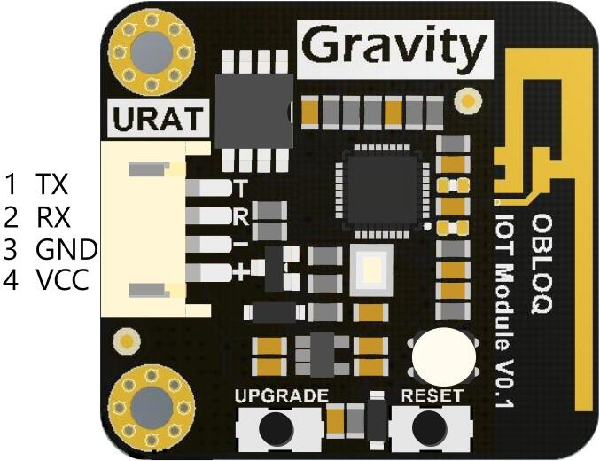
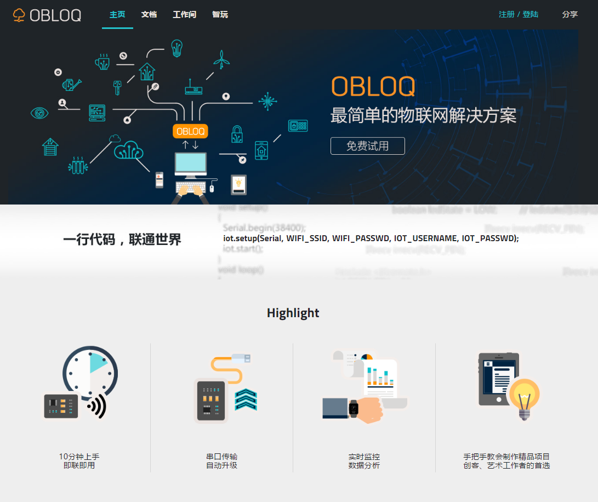

# OBLOQ常见问题


## OBLOQ模块简介

功能：无线上网模块。能使设备能通过wifi连接上网，收发数据。正常工作时OBLOQ上绿色LED灯常亮。

结构图：




各个接口的含义

|  名称  | 功能描述  |
| :--: | :---: |
|  TX  | 串口发送端 |
|  RX  | 串口接收端 |
| GND  | 电源负极  |
| VCC  | 电源正极  |


信号灯含义

|  颜色  | 指示状态   |
| :--: | :----- |
|  红色  | 没有正常运行 |
|  白色  | 连上wifi |
|  蓝色  | 有新版固件  |
|  黄色  | 连接服务器中 |
|  绿色  | 正常工作   |


## OBLOQ模块固件升级

1. OBLOQ模块的指示灯显示蓝色的时候，表示有新版固件。
2. OBLOQ指示小灯处于蓝色常亮的状态下按一下UPGRADE按钮即可自动进入固件升级，蓝色小灯开始闪烁。
3. 固件升级成功：蓝色小灯由闪烁变成常亮，手动重启UNO主控板。
4. 固件升级失败：指示灯由蓝灯闪烁直接变红灯，并且重新连接物联网会再次提示有新版固件，请重新从步骤1开始操作。


## OBLOQ兼容主控板简介

市面上常见的支持串口通信的主控板都可以，比如Arduino UNO主控板系列。


## OBLOQ支持的设备

只要设备能够被兼容OBLOQ的主控板控制，就可以使用。如各种传感器模块、小灯模块等。


## 使用OBLOQ发送数据

步骤：

1. 在OBLOQ-web新建设备，这样这个设备可以接收、储存硬件发送过来的数据。
2. 完成发送端固件程序（注意OBLOQ-web的账户密码，设备名，wifi SSID， wifi密码都要填写正确）。
3. 给主控板烧录发送端固件程序。
4. 准备好发送端硬件设备、主控板和OBLOQ模块，完成发送端硬件搭建（注意引脚连线要正确）。
5. 给主控板供电，让设备开始工作，最后在OBLOQ-web监测生成的数据。


## 使用OBLOQ接收数据

步骤：

1. 找到提供数据的OBLOQ-web设备，作为接收数据的数据源。
2. 完成接收端固件程序（注意OBLOQ-web的账户密码，设备名，wifi SSID， wifi密码都要填写正确）。
3. 给主控板烧录接收端固件程序。
4. 准备好接收端硬件设备、主控板和OBLOQ模块，完成接收端硬件搭建（注意引脚连线要正确）
5. 给主控板供电，让设备开始工作，最后查看接收端设备工作状况，判断OBLOQ-web设备数据是否被正确接收。


## 自定义物联网应用的程序

当我们有个新的设备，我们改怎么通过OBLOQ将它连接到库联网呢？


我们首先需要在OBLOQ-web上注册一个新设备：

例如：NewDevice

**发送设备：**

如果这个设备是向物联网发送消息，那么我们只要在满足触发条件的情况下，修改loop()函数里面的iot.publish()函数即可：

```c++
void loop(void)

{

    if(触发条件成立)
      iot.publish("NewDevice", "发送的消息1");
    else
      iot.publish("NewDevice", "发送的消息2");
    iot.loop();

}

```


**接收设备：**

如果设备作为接收设备，我们需要在setup()里面注册一下接收设备的回调函数，然后在回调函数里面接收消息和处理消息：

```c++
void * myTest(const char *data, uint16_t len) //设备对应的消息回调函数

{

  //data 存放接收消息的指针，通过这个指针读取接收的消息内容

  //在这里控制设备

}

void setup(void)

{

  Serial.begin(115200);

  mySerial.begin(38400);               //波特率38400

  while(!Serial);

  iot.setDbgSerial(Serial);

  iot.setup(mySerial, WIFI_SSID, WIFI_PASSWD, IOT_USERNAME, IOT_PASSWD);

  iot.subscribe("NewDevice", myTest);   // 注册设备和对应的消息回调函数    

  iot.start();

}

```

可以参考教程中的样例代码，根据实现需要进行修改。


## 如何物理连接设备、OBLOQ模块、主控板

可以参考教程中示例连接方法。如下图：


## OBLOQ-web简介

OBLOQ-web指的是obloq.dfrobot.com网站，包含数据发送、数据呈现、数据处理和使用教程等功能。它是一个转发设备数据和发布控制指令的中心。这些数据可以在OBLOQ-web上可视化呈现。

- 用户能够直接通过OBLOQ-web发送控制指令，进行设备控制；
- 也可以将OBLOQ-web当作一个指令中转站，用“设备1”（sender）给远端“设备2”（receiver）发送控制指令。
- 用户能在设备页面进行数据筛选，并将筛选出来的数据可视化。




## 在OBLOQ-web上查看数据

进入工作间，点击某设备，进入设备页面，即可查看当前设备的消息（数据）。

设备数据分为两种：

| 消息类型    | 含义              |
| ------- | --------------- |
| command | 发送给设备的数据，要求设备执行 |
| event   | 从设备接收的数据        |


## 在OBLOQ-web进行设备数据处理

进入工作间，点击进入某设备的设备界面，在筛选栏中选定条件对数据进行筛选，即可抽取出符合条件的数据，并且自动生成可视化数据图表。


## 故障检测

**Q：OBLOQ模块通电后，板子的信号灯不亮**

A：电源正负极接线有问题，检查接线


**Q：OBLOQ模块信号灯一直保持红色常亮**

A：wifi热点断开或者程序中的wifi账号和密码错误。


**Q：OBLOQ模块信号灯一直保持白色常亮**

A：wifi能成功连接，尝试重启UNO主控板。


**Q：OBLOQ模块信号灯一直保持黄色常亮**

A：模块联网过程中卡在连接服务器的过程中，重启UNO主控板。


**Q：烧完固件后，OBLOQ模块信号灯保持红色常亮**

A：检查wifi热点是否断开或重启开发板。


**Q：物联网Web端没有就收到发送过来的消息**

A： 检查程序中的设备名称和物联网Web端的设备名称是否保持一致