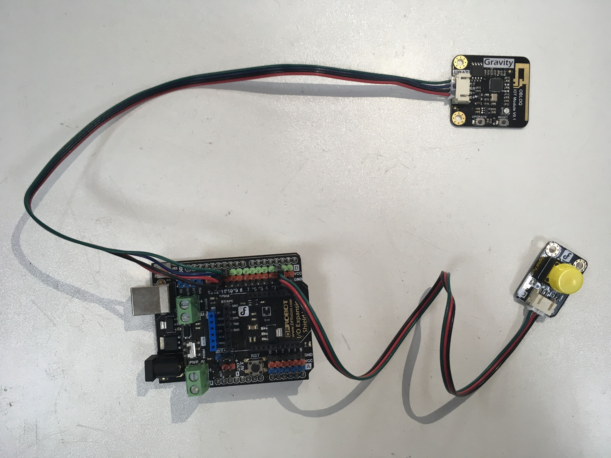
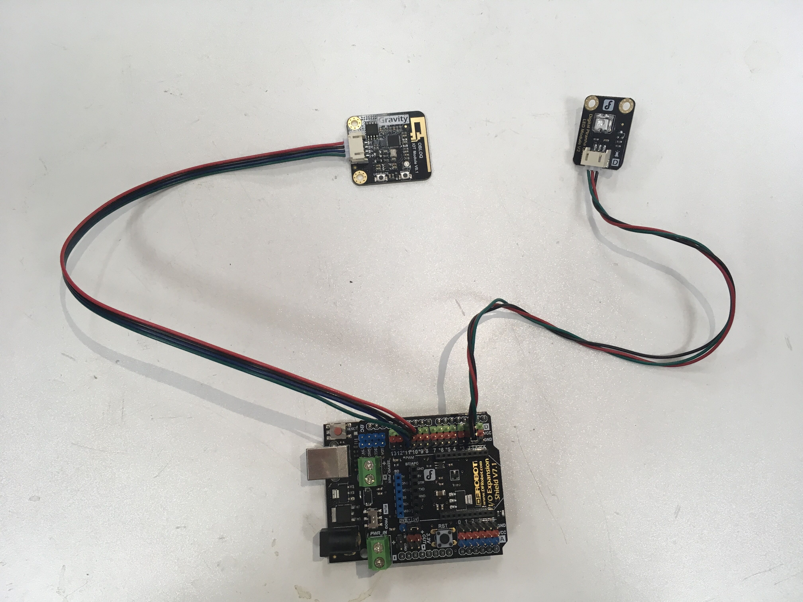
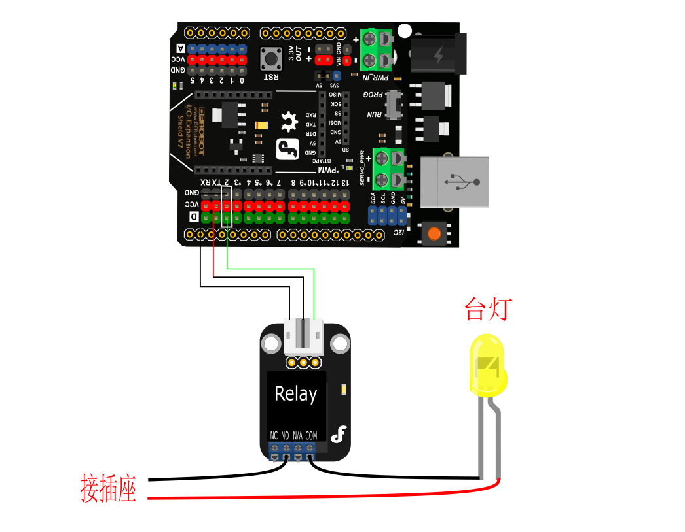
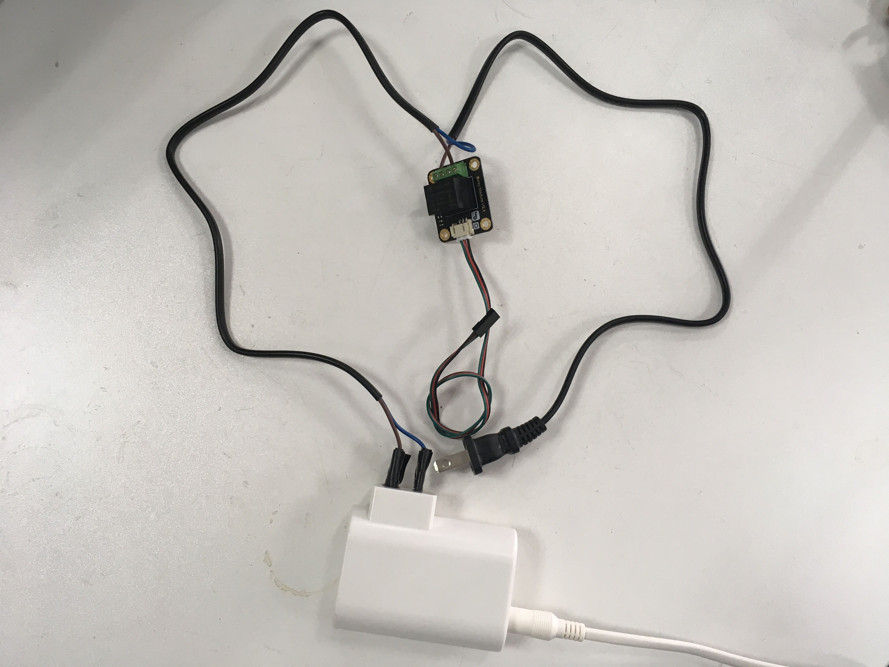
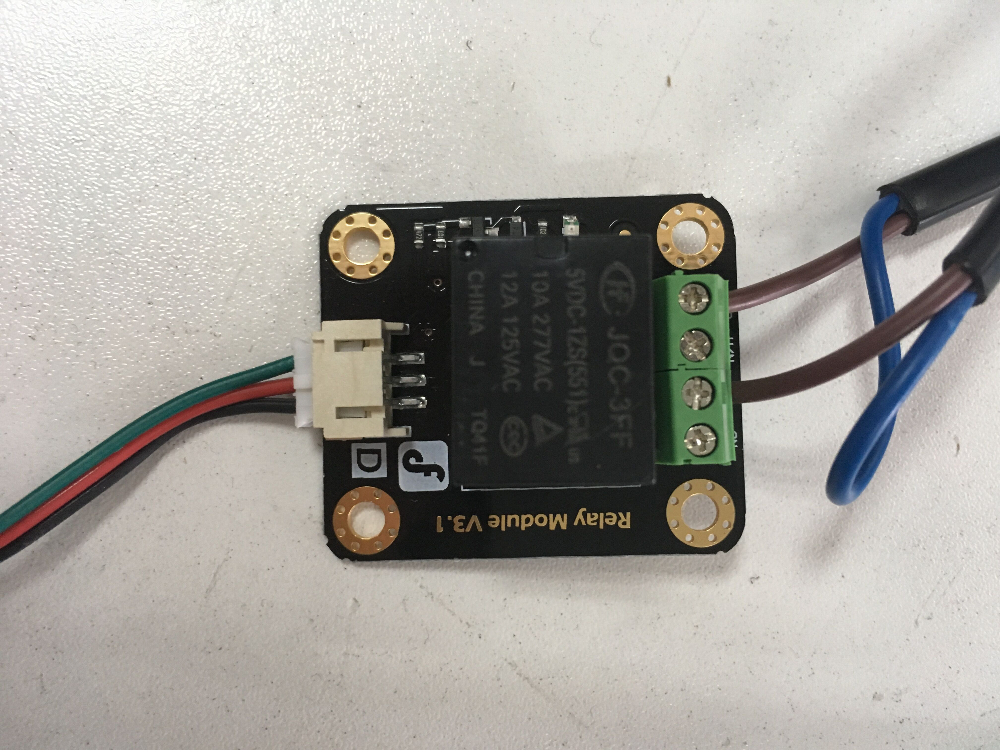
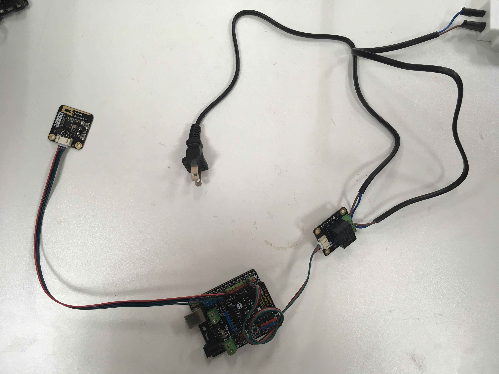
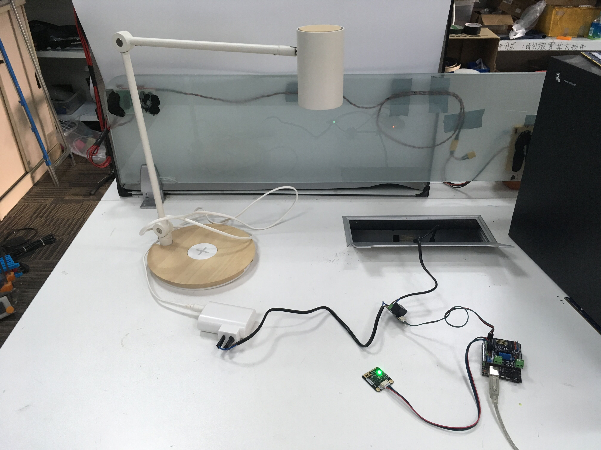

# OBLOQ智玩系列-按钮远程控制小灯亮灭

## 0. 项目简介

这次的项目，我们将用OBLOQ实现一个按键远程无线控制一台台灯的亮灭。

在这里，按键是发送端，台灯是接收端。

发送端OBLOQ模块将按键的状态发送到OBLOQ网站，OBLOQ网站接着将接收到的按键状态转发到接收端OBLOQ模块，最后接收端主控接过信息，通过判断按键状态来控制台灯亮灭。

## 1. 在OBLOQ网站上创建项目

第一步，我们需要建立好信息中转站。换句话说，我们将在OBLOQ网站里新建一个按键设备，用来接收发送端信息，并将信息转发到接收端。

**创建设备：设备一**

登录OBLOQ官网，注册账号。进入工作间。观察到左侧的用户信息：

物联网ID (clientID): "ryHxUYFeW"

物联网Token (devicesToken): "SyPZIFKxZ|BJgD-IKYeZ" 


在右侧工作界面中，新建一个设备，默认名字“设备一”。

观察到新设备自动生成一个Topic，作为设备唯一可识别码。

当前设备Token: "rkX4LYFeZ"


### 

为了稍后编程需要，记下这些关键信息，例如：

- clientID：ryHxUYFeW
- devicesToken：SyPZIFKxZ|BJgD-IKYeZ
- Topic：rkX4LYFeZ


## 2. 硬件搭建##

接着用杜邦线连接好OBLOQ系列硬件。这样一套硬件设备搭建完成后，在wifi环境给主控板烧录相应的程序，就能直接使用了。


**硬件清单**

| 名称                         | 数量              |
| -------------------------- | --------------- |
| OBLOQ模块                    | $$1$$ ，推荐 $$2$$ |
| 主控板（如：Arduino UNO控制板*）     | $$1$$ ，推荐 $$2$$ |
| 按键模块（如选择使用虚拟按键，可省略此项）**    | $$0$$ ，推荐 $$1$$ |
| LED模块（或用一个台灯和一个继电器模块代替）*** | $$1$$           |
| 杜邦线                        | 若干              |

* 关于主控板，这里挑选Arduino UNO及其扩展板作为例子讲解，其他兼容的主控板也可以使用。
* 如果只有1套OBLOQ模块和主控，这套系统也是能实现的。此时由于没有多余的主控和OBLOQ模块去支持“按键”，我们依然能够在OBLOQ网站网站中创建一个虚拟按键功能，并用虚拟按键控制远端台灯的亮灭。
* 台灯和LED模块都可以作为被操控设备，任选一个即可。如果想适用于实际生活，推荐使用台灯。


**发送端**


实际连线情况（实际使用还需要给主控板供电）：




**接收端**（当使用LED模块代替台灯时）


实际连线情况（实际使用还需要给主控板供电）：



如果仅使用**LED模块**，到此为止，就能完成全部硬件搭建。

如果使用的是**台灯**，则需要多加一个**继电器模块**，接线稍微复杂一些。正常台灯的输入电压是220V，需要直接接到家庭用电的插座上才能正常工作，而主控板一般只能输出5V低压，不能使台灯正常工作。如果有继电器模块的话，我们就能使用Arduino UNO的弱电（5V）控制强电（220V）。**我们需要做线改装，由于该过程可能接触220V电压，比较危险，请大家做好绝缘保护，没有改装经验的人请不要尝试。**下面是具体操作方法。

**1.将继电器连接到台灯的输入端口**

台灯的插座有两根线，一根火线一根地线。将其中一根线剪断，串连接上继电器，一端接入NO（常开），一端接入COM（公共端）。如果不想破坏台灯的电线，也可以找根平时不用的带插头的线来改装，如下图：




实物连接图：






**2. 将烧录好接收端程序的Arduino UNO连接到继电器，连线的引脚和示意图相同**




**3. 接通台灯电源，插入台灯插座即可。接通Arduino UNO电源，可以USB供电，也可以电池供电。**




## 3. 在主控板上烧录控制程序

为了能让这些模块和板子运作起来，需要向主控板烧录程序。

现在，我们要制作两个控制程序，分别控制按键和台灯（或LED模块）。


**在写控制程序之前，你可能需要知道Arduino UNO程序烧录的基本操作步骤**

1. 查看 [Arduino中文手册](http://www.dfrobot.com.cn/images/upload/File/20150129112804mdoxsq.pdf) 第1-13页，下载安装Arduino IDE和驱动，配置板卡和串口.
2. 下载DFRobot的 IoT库文件，并在Arduino内部加载。（[IoT库文件下载地址](https://github.com/DFRobot/IotTest), [Arduino加载库文件的方法](https://jingyan.baidu.com/article/8065f87f904f4c2331249881.html)）
3. 在Arduino IDE内输入程序源码，进行校验（也就是编译），最后下载（也就是烧录）。


### 3.1 发送端程序——按键（Button）

这段内容适用于有两套OBLOQ模块和主控的用户，如果您只有一套，小节末尾段落另行说明实现方法。


**程序逻辑**

发送端的程序主要是循环检测事件是否触发，一旦事件触发，就向OBLOQ网站发送信号，OBLOQ网站则向相应联网设备转发此信号。

本例中，程序会反复检测按键是否按下，当检测到按键第一次按下的时候，OBLOQ系统向设备Lamp发送消息”1“，当检测到按键第二次按下的时候，向设备Lamp发送消息”0“，如此循环检测执行。


**特别注意！**

实际程序中必须修改程序中以下信息才能正常使用。

```c++
#define WIFI_SSID       "DFSoftware"            //wifi名称
#define WIFI_PASSWD     "dfrobotsoftware"       //wifi密码
#define CLIENT_ID       "ryHxUYFeW"             //物联网ID
#define IOT_TOKEN       "SyPZIFKxZ|BJgD-IKYeZ"  //物联网账Token
...
...
iot.publish("rkX4LYFeZ", tempString);  			//"rkX4LYFeZ"改为当前通信的设备Topic
...
```


**具体代码**

```c++
#include <Arduino.h>
#include <SoftwareSerial.h>
#include "Iot.h"

Iot iot;   

SoftwareSerial mySerial(10, 11);         // RX, TX

#define WIFI_SSID       "DFSoftware"            //wifi名称
#define WIFI_PASSWD     "dfrobotsoftware"       //wifi密码
#define CLIENT_ID       "ryHxUYFeW"             //物联网ID
#define IOT_TOKEN       "SyPZIFKxZ|BJgD-IKYeZ"  //物联网账Token

char *tempString =      "string";
int normalVoltage = 0;                     //按键防抖动的相关参数
bool isPress = false;
bool isClick = false;;
bool hasPress = false;
int  buttonPin = 2;
bool currentState = false;
unsigned long currentTime = 0;
bool sendFlag  = true;

void setup(void)
{
  mySerial.begin(38400);                   //打开软串口，波特率必须是38400
  pinMode(buttonPin,INPUT);
  iot.setup(mySerial, WIFI_SSID, WIFI_PASSWD, CLIENT_ID, IOT_TOKEN);
  iot.start();
}
 
void loop(void)
{
  keyScan();
  if(isClick)
  {
    if(sendFlag){
      itoa(1,tempString,10);                 //方法一：将整型转换成字符串，然后再发送
      iot.publish("rkX4LYFeZ", tempString);    
      sendFlag = false;
    }
    else{
      iot.publish("rkX4LYFeZ", "0");             //方法二：直接发送字符串0也可以
      sendFlag = true;
    }    
  }
 iot.loop();
}

//按键扫描
void keyScan()
{
   if((digitalRead(buttonPin)!=normalVoltage)&&!isPress)
    {
        isPress = true;
        currentTime = millis();
    }
    else if (isPress)
    {
        if (millis()-currentTime>=10)
        {
            if(digitalRead(buttonPin)!=normalVoltage)
            {
                currentState = true;
            }
            else
            {
                currentState = false;
                isPress = false;
            }
        }
    }
    isClick = false;
    if (currentState) {
        hasPress = true;
    }
    else if(hasPress) {
        isClick = true;
        hasPress = false;
    }
}
```


程序烧录完成后，为了确保系统能按照新固件的逻辑正确执行，按下主控板上的“Reset”按键重启主控板，完成固件重启。


**没有实物按键模块，我们可以用虚拟按键**

如果只有一套OBLOQ模块和主控，按键功能依旧能够通过在OBLOQ网站虚拟发送按键开关的信息实现。

如果你没有“按键”实物，可以按照如下方法操作，给出虚拟“按键”信号。

1. 登录OBLOQ网站，在设备列表中找到按键设备：


2. 点击进入，可查看**设备详细信息**：


3. 发送消息。在“发送新消息”栏中输入消息内容，再点击后面的**发送**按钮即可。本例中，发送消息“0”关闭台灯，发送消息“1”打开台灯。


4. 查看消息是否发送成功。在点击发送消息按钮后，如果发送成功，消息列表里面将出现刚才输入的消息。完成接收端搭建后，此命令可让远方的LED灯（或台灯）打开或关闭。


### 3.2 接收端程序——台灯/LED模块（Lamp）


**程序逻辑**

接收端的程序主要是循环检测监听的设备是否发出信息，一旦该设备发出信息，将根据信息内容执行相应任务。

本例中，设备Lamp会反复判断是否接到来自“设备一”的新消息。当接收到数字”1“，打开LED；若接收到数字”0“，则关闭LED。如此循环检测执行。


**特别注意！**

实际程序中必须修改程序中以下信息才能正常使用。

```c++
#define WIFI_SSID       "DFSoftware"            //wifi名称
#define WIFI_PASSWD     "dfrobotsoftware"       //wifi密码
#define CLIENT_ID       "ryHxUYFeW"             //物联网ID
#define IOT_TOKEN       "SyPZIFKxZ|BJgD-IKYeZ"  //物联网账Token
...
...
iot.subscribe("rkX4LYFeZ", eventHandle);        //"rkX4LYFeZ"改为当前通信的设备Topic
...
```


**具体代码**

```c++
#include <Arduino.h>
#include <SoftwareSerial.h>
#include "Iot.h"

Iot iot;                 

int ledPin = 2;                            //led小灯引脚

SoftwareSerial mySerial(10, 11);         // RX, TX

#define WIFI_SSID       "DFSoftware"            //wifi名称
#define WIFI_PASSWD     "dfrobotsoftware"       //wifi密码
#define CLIENT_ID       "ryHxUYFeW"             //物联网ID
#define IOT_TOKEN       "SyPZIFKxZ|BJgD-IKYeZ"  //物联网账Token

void * eventHandle(const char *data, uint16_t len)
{
  
   switch(atoi(data))                      //将物联网发送字符串转换成数字
    {
      case 0:
        digitalWrite(ledPin,LOW);           //关闭小灯
        break;
      case 1:
        digitalWrite(ledPin,HIGH);          //打开小灯
        break;
      default:break;
    }
  
}

void setup(void)
{ 
  mySerial.begin(38400);
  pinMode(ledPin,OUTPUT);
  iot.setup(mySerial, WIFI_SSID, WIFI_PASSWD, CLIENT_ID, IOT_TOKEN);
  iot.subscribe("rkX4LYFeZ", eventHandle);
  iot.start();
}

void loop(void)
{
	iot.loop();
}
```


固件写好后，同发送端程序一样，向控制台灯/LED模块的主控板中烧入即可。程序烧录完成后，为了确保系统能按照新固件的逻辑正确执行，按下主控板上的“Reset”按键重启主控板，完成固件重启。


## 4. 结果展示

现在看下这个项目的具体效果吧。

1. 保持硬件设备上电状态。OBLOQ模块正常工作状态下LED指示灯显示绿色常亮。
2. 现在，尝试按下按键（或虚拟按键），远方的台灯就能被无线操控亮灭了。


下图是安装好的按键和台灯。


按下按键，打开台灯。


再次按下按键，关闭台灯。


如果你并没有看到理想中的结果，检查一下是不是在下面的哪些步骤出了一些小问题：

* 程序中的wifi账号（SSID）、密码，clientID、devicesToken、Topic要保证书写的正确性；
* 硬件连线要正确，尤其注意实际使用的引脚和程序是否能对应；
* 当信号灯保持红色，蓝色或者黄色不变的时候，复位UNO开发板。


## 5. 总结和拓展
我们通过完成“按键联网控制小灯”这个简单的小项目，了解了如何利用OBLOQ模块制作联网设备，包括可以发送信息的“发送端设备”（按键），和接收信息并执行指令的“接送端设备”（台灯）。

步骤总结：

1. 在OBLOQ网站上创建项目
2. 搭设硬件
3. 分别在发送端和接收端的主控板上烧录对应的固件
4. 重启发送端和接收端主控板，并进行项目展示


如果顺利的话，项目到这里就算完成了。


然而，意外情况也是可能发生的。如果你遇到了不可判别原因的问题，可以尝试下面这段代码“检测故障”。

将这段代码编译后，烧入疑似故障的硬件相连的主控板里，重启运行固件，查看串口打印出的消息，我们能够查看OBLOQ模块连接wifi和物联网服务器的连接状态，比如OBLOQ模块有没有连接成功。


### 样例代码

```c++
/****************************************************************************************
* DFRobot_advancedReceive.
*
* Copyright (C)    2017   [DFRobot](http://www.dfrobot.com),
* This Library is free software: you can redistribute it and/or modify
* it under the terms of the GNU General Public License as published by
* the Free Software Foundation, either version 3 of the License, or
* (at your option) any later version.
*
* Description:
* Through the callback function to check the Internet of things connected to the various states, 
* used to debug and modify the program
* 
*  //EVENT_CODE_WIFI               //0:ssid或密码错误,1:已连接,2:已断开
*  //EVENT_CODE_SERVER             // 0:用户名或密码错误,1:已连接,2:已断开
*  //EVENT_CODE_NEW_VERSION        // x:最新版本字符串信息
*  //EVENT_CODE_UPGRADE_PERCENT    // 0~100 更新进度
*  //EVENT_CODE_UART               // 0:异常,1:正常
*  //EVENT_CODE_UNKNOWN            // 0:未定义错误
*  
* author  :  Jason
* version :  V1.0
* date    :  2017-03-06
*****************************************************************************************/

#include <SoftwareSerial.h>
#include "Iot.h"

#define IOTDBG(...) if(1){Serial.print("["); Serial.print(__FUNCTION__); Serial.print("(): "); Serial.print(__LINE__); Serial.print(" ] "); Serial.println(__VA_ARGS__);}
void * eventCb(uint8_t type, const char *data, uint16_t len);
Iot iot(eventCb);

SoftwareSerial mySerial(10, 11);         // RX, TX

#define WIFI_SSID       "DFSoftware"            //wifi名称
#define WIFI_PASSWD     "dfrobotsoftware"       //wifi密码
#define CLIENT_ID       "ryHxUYFeW"             //物联网ID
#define IOT_TOKEN       "SyPZIFKxZ|BJgD-IKYeZ"  //物联网账Token

unsigned long long sendTime = 0;
bool sendFlag = true;

void * eventCb(uint8_t eventType, const char *data, uint16_t len)
{
 
  IOTDBG(eventType,HEX);
  IOTDBG(data[0],HEX);
  switch(eventType){
    case EVENT_CODE_WIFI:
      if(data[0] == 0){
        IOTDBG("EVENT_CODE_WIFI: ssid or passwd error");
      }else if(data[0] == 1){
        IOTDBG("EVENT_CODE_WIFI: wifi connect");
      }else if(data[0] == 2){
        IOTDBG("EVENT_CODE_WIFI: wifi disconnect");
      }else{
        IOTDBG("EVENT_CODE_WIFI: wifi error arg");
      }
      break;
    case EVENT_CODE_SERVER:
      if(data[0] == 1){
        IOTDBG("EVENT_CODE_SERVER: server connect");
      }else if(data[0] == 2){
        IOTDBG("EVENT_CODE_SERVER: server disconnect");
      }else if(data[0] == 0){
        IOTDBG("EVENT_CODE_SERVER: username or passwd error");
      }else{
        IOTDBG("EVENT_CODE_SERVER: server error arg");
      }
      break;
    case EVENT_CODE_NEW_VERSION:
      IOTDBG("eventType: has new Version");
      IOTDBG(data);
      //iot.update();//默认升级到当前平台最新版//iot.update(PLATFORM_CURRENT,"0");
      break;
    case EVENT_CODE_UPGRADE_PERCENT:
      //uint8_t percent = (uint8_t)data[0];
      IOTDBG("eventType: upgrade percent:");
      IOTDBG((uint8_t)data[0]);
    case EVENT_CODE_UART:
      break;
    case EVENT_CODE_UNKNOWN:
      break;
    default:
      break;
  }
}

void * myTest(const char *data, uint16_t len)
{
  Serial.print("my Button Recv:");
  Serial.println(data);
  Serial.print("len=");
  Serial.println(len);
  return NULL;
}

void setup(void)
{
  Serial.begin(115200);
  mySerial.begin(38400);
  while(!Serial);
  iot.setDbgSerial(Serial);
  iot.setup(mySerial, WIFI_SSID, WIFI_PASSWD, CLIENT_ID, IOT_TOKEN);
  iot.subscribe("rkX4LYFeZ", myTest);          
  iot.start();
}

void loop(void)
{
  //两秒钟发送一次字符串，循环发送"down","up"
	if(millis() - sendTime > 2000){
		sendTime = millis();
		if(sendFlag){
      sendFlag = false;
			iot.publish("rkX4LYFeZ", "down");
		}else{
      sendFlag = true;
			iot.publish("rkX4LYFeZ", "up");
		}
	}
	iot.loop();
}
```


有经验的用户可能已经看出来了，这是回调函数的一种用法。

下表是这段代码打印出来的日志信息的具体含义。请大家核对。


| log消息                                    | 消息含义         |
| :--------------------------------------- | ------------ |
| **EVENT_CODE_WIFI: ssid or passwd error** | wifi账号或者密码错误 |
| **EVENT_CODE_WIFI: wifi connect **       | wifi连接成功     |
| **EVENT_CODE_WIFI: wifi disconnect**     | wifi断开连接     |
| **EVENT_CODE_SERVER: server connect**    | 服务器连接成功      |
| **EVENT_CODE_SERVER: server disconnect** | 服务器断开连接      |
| **EVENT_CODE_SERVER: username or passwd error** | 物联网账号或密码错误   |
| **eventType: has new Version**           | 有新固件         |


**附：如何查看串口打印消息**

打开Arduino IDE 的串口工具：


查看调试信息：


