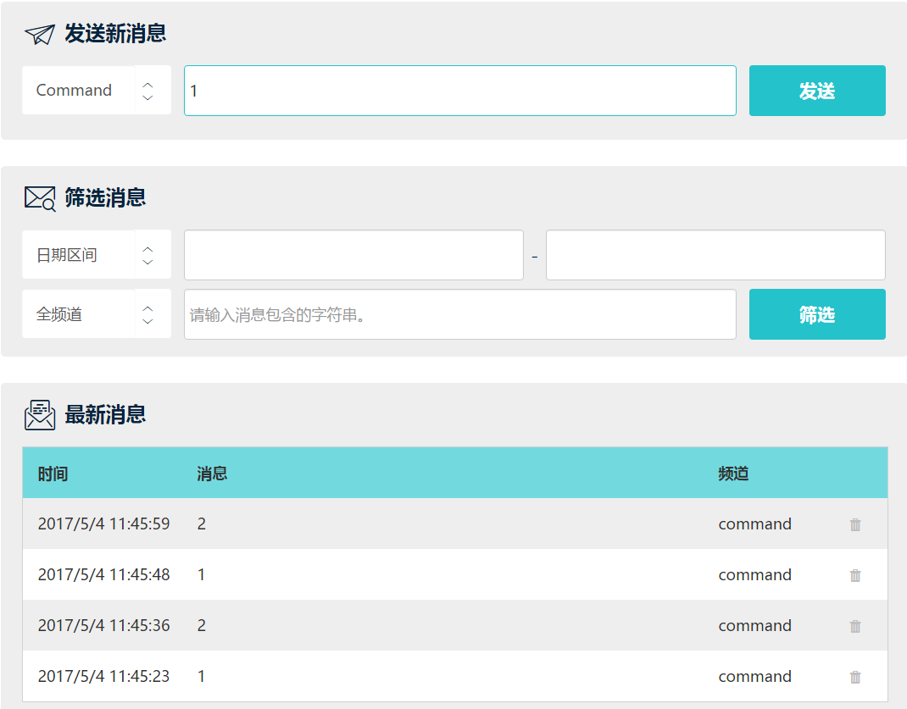
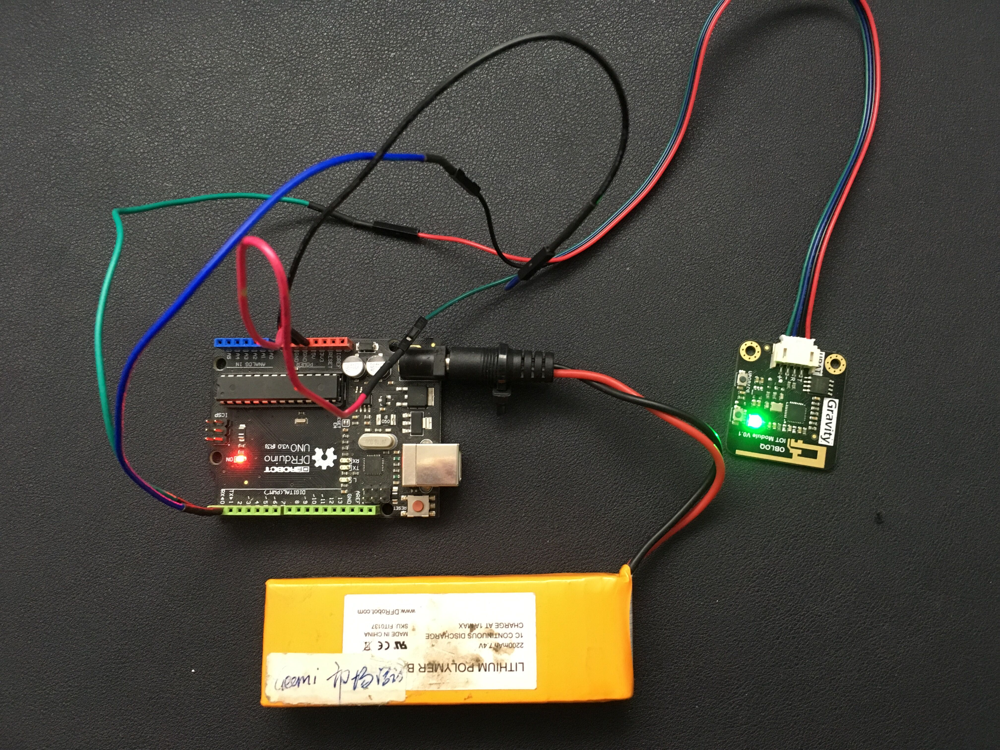
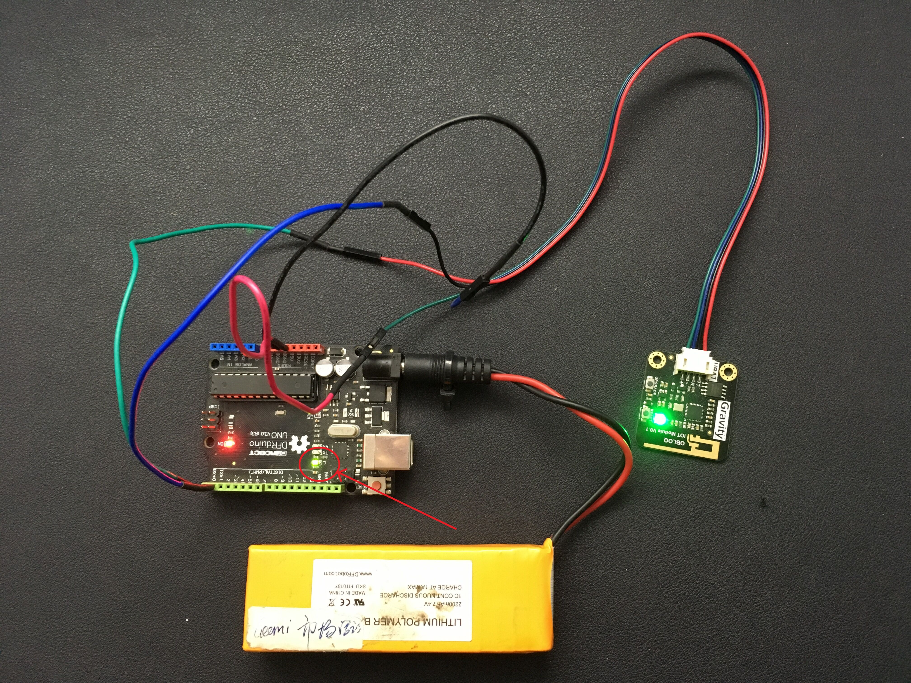
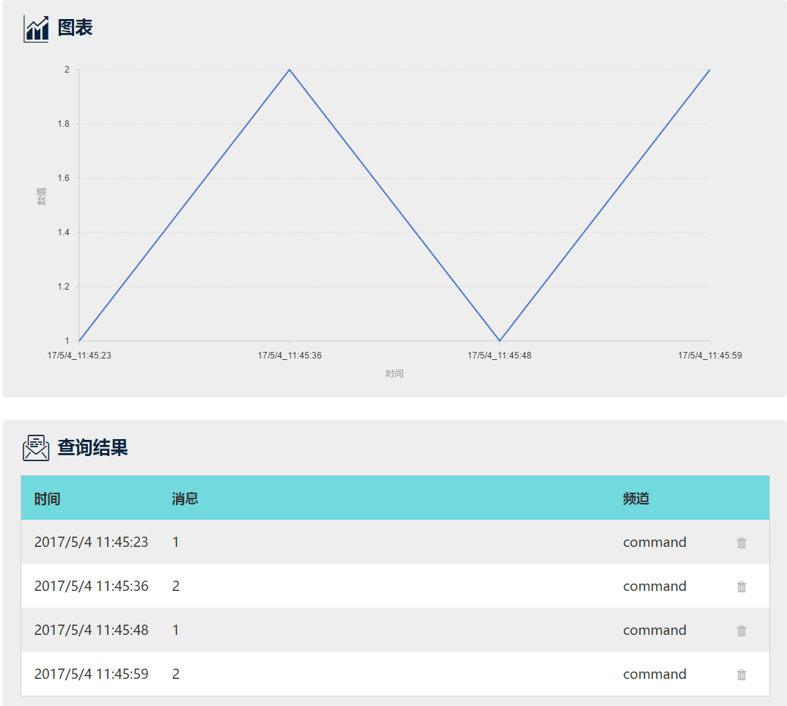

# OBLOQ简单教程

## 0. 一分钟简介

OBLOQ模块是设备连接互联网的中间件。

如果想将小台灯、小喇叭或其他用电器接入网络，对它们进行简单的远程监控和操作，OBLOQ一定是你的首选。OBLOQ配置十分简单，无需复杂的编程，15分钟就足够让这些小物件在互联网上拥有生命。


工具清单：

* 需要连接网络的设备
* 主控板（如 Arduino UNO）
* OBLOQ模块
* IOT网站（iot.dfrobot.com.cn）

经过组合，在wifi环境下，设备通过OBLOQ模块就能连上互联网，按时发送设备数据或者接收远端控制指令。


形象点说，可以把OBLOQ模块看成一个“网卡”。

设备（包含主控）插上这个“网卡”，在Wifi环境下就能和互联网互通数据了。

可以这样理解，
$$
设备+主控板=智能设备
$$

$$
智能设备+OBLOQ模块=物联网智能设备
$$

这些数据通过IOT网站进行发送/转发，并实现数据可视化。


##### （附）OBLOQ模块简介

功能：无线上网模块。能使设备能通过wifi连接上网，收发数据。正常工作时OBLOQ上绿色LED灯常亮。


接口：

|  名称  |  功能描述   |
| :--: | :-----: |
|  TX  | 发送端(串口) |
|  RX  | 接收端(串口) |
| GND  |  电源负极   |
| VCC  |  电源正极   |


信号灯：

|  颜色  | 指示状态   |
| :--: | :----- |
|  红色  | 没有正常运行 |
|  白色  | 连上wifi |
|  蓝色  | 有新版固件  |
|  黄色  | 连接服务器中 |
|  绿色  | 正常工作   |


## 1. 在IOT网站上创建项目

通过一个简单的案例，我们了解如何使用OBLOQ。


**创建项目设备：设备一**

登录IOT网站，注册账号。进入工作间。新建一个设备，默认名字“设备一”。


观察到设备唯一识别码Topic以及左侧的用户信息。


为了稍后编程需要，记下他们：

* iot_id: Skv3zKyNb
* iot_pwd: r1lD3ztJ4b
* Topic: BJTS0iaU-


## 2. 硬件搭建##

接着用杜邦线连接各硬件接口，搭建硬件设备，在wifi环境给主控板烧录相应的程序，就能直接使用了。


**硬件清单**

| 名称                     | 数量   |
| ---------------------- | ---- |
| OBLOQ模块                | 1    |
| 主控板（如：Arduino UNO控制板*） | 1    |
| LED模块                  | 1    |
| 杜邦线                    | 若干   |

*关于主控板的选择，这里挑选Arduino UNO作为例子讲解，其他兼容的主控板也可以使用。


**连线图示意**


## 3. 在主控板上烧录控制程序

完成硬件搭建后，为了能让这些模块和板子运作起来，需要向主控板烧录程序。

下面是一段示例代码：

注意：根据自己的环境信息修改样例代码中的wifi信息和测试IOT网站账号。

```c++
iot.setup(mySerial, WIFI_SSID, WIFI_PASSWD, CLIENT_ID, IOT_TOKEN);
```

**具体代码**

```c++
#include "Iot.h"
Iot iot;   
void * eventHandle(const char *data, uint16_t len)
{
   switch(atoi(data))              //将物联网发送字符串转换成数字
    {
      case 1:
        digitalWrite(13,HIGH);     //打开小灯
        break;
      case 2:
        digitalWrite(13,LOW);      //关闭小灯
        break;
      default:break;
    }
}

void setup(void)
{ 
  Serial.begin(38400);
  pinMode(13,OUTPUT);
  iot.setup(Serial, "DFSoftware", "dfrobotsoftware","ryHxUYFeW", "SyPZIFKxZ|BJgD-IKYeZ");
  iot.subscribe("rkX4LYFeZ", eventHandle);   //rkX4LYFeZ是物联网设备名
  iot.start();
}
void loop(void)
{
  iot.loop();
}
```


**注：烧录前确保UNO的Rx(0),Tx(1)引脚和OBLOQ断开连接**，程序烧录需要使用串口。在高级教程中，我们将通过使用软串口解决这个问题。

烧录完成后，连接OBLOQ模块的Rx,Tx，再按下主控板上的“Reset”按键重启主控板，等待模块联网即可。


## 4. 结果展示

现在看下这个项目的具体效果吧。

1. 保持硬件设备上电状态。OBLOQ模块正常工作状态下LED指示灯显示绿色常亮。
2. 登录IOT网站工作间，检查是否存在与硬件通信的设备。
3. 在该设备消息里面发送数字“1”，板载连接在13号引脚的小灯会被点亮，发送数字“2”，小灯熄灭。




主控板上13号引脚的小灯原先是熄灭状态。



发送数字“1”，小灯会被点亮。



我们重新回到IOT网站。观察到设备页面中间的筛选工具，如果选定“日期区间”，比如说“1日”，点击“筛选”就能查看数据筛选结果，并查看数据分析图。




如果你并没有看到理想中的结果，检查一下是不是在下面的哪些步骤出了一些小问题：

* 程序中的wifi账号（SSID）、密码，clientID、devicesToken、Topic要保证书写的正确性；
* 硬件连线要正确，尤其注意实际使用的引脚和程序是否能对应；
* 当信号灯保持红色，蓝色或者黄色不变的时候，复位UNO开发板。


## 5. 总结
简单教程到此为止。

通过这个项目，我们了解了如何利用OBLOQ模块制作最基础的联网设备，并且使用此设备发送信息。

步骤总结：

1. 在IOT网站上创建项目设备
2. 搭设硬件
3. 在发送端的主控板上烧录对应的固件
4. 展示项目效果，查看得到的设备数据

